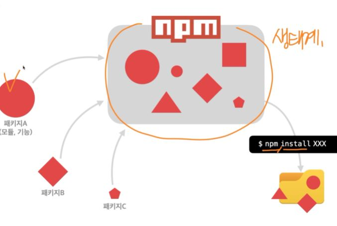

## JavaScript Essentials

**Node.js**

Chrome V8 JavaScript 엔진으로 빌드된 Js 런타임(프로그래밍 언어가 동작하는 환경)

**NVM**

node version manager, nodejs의 버젼을 관리해주며 협업시에 중요하게 사용이 된다. 지금 프로젝트에 노드는 어떤 버젼을 사용할지 변경이 가능하며 유용하게 사용함

**NPM**

NPM(Node Package Manager)은 전 세계 개발자들이 만든 다양한 기능(패키지, 모듈)들을 관리



## npm으로 빈 프로젝트 생성
```bash
# -y는 yes의 줄임말 
npm init -y
```
node module들을 관리하기 위해 필요한 package.json을 기본값으로 설정해서 생성해준다 

## install시에 -D의 유무 차이

```bash
# 개발용 의존성 패키지 설치(-D, --save-dev)
npm install parcel-bundler -D

# 일반 의존성 설치
npm install lodash 
```

개발용 의존성은 특정 패키지가 개발할때만 필요하고 웹 브라우저 동작시 필요가 없다는 뜻  
일반 의존성은 웹 브라우저에서도 필요한 경우가 있다

## parcel-bundler를 이용해서 로컬 환경에서 개발서버를 여는 방법

```json
  "scripts": {
    "dev": "parcel index.html"
  }
```
위 코드로 json을 바꿔준뒤
```bash
& npm run dev
```
위 코드를 실행하면 된다

## 사용자들이 보는용도의 결과물을 출력하는 방법

```json
"scripts": {
    "dev": "parcel index.html",
    "build" : "parcel build index.html"
  },
```

build 스크립트를 추가해주어서 실행하면 된다  
기존 코드를 번들해서 결과를 보여준다

> 번들(bundle)은 프로젝트 개발에 사용한 여러 모듈(패키지)을 하나로 묶어내는 작업이다

## 유의적 버전(Semantic Versioning, SemVer)

Major.Minor.Patch(E.g, 12.14.1)로 표기함 

- Major : 기존 버전과 호환되지 않는 새로운 버전
- Minor : 기존 버전과 호환되는 새로운 기능이 추가된 버전
- Patch : 기존 버전과 호환되는 버그 및 오타 등이 수정된 버전

> ^Major : Major 버전안에서 가장 최신 버전으로 업데이트 가능(Major 버전은 바뀌지않고 Minor,Patch가 바뀔수가 있다)

## 이전 버전설치/업데이트

```bash
#lodash
## 4.17.20버전으로 lodash를 덮어씀
$ npm install lodash@4.17.20

## update
$ npm update lodash
```

> 만약 package.json에서 `^` 기호를 지운다면 해당 버전만 사용한다는 의미

## .gitignore

파일 폴더명을 명시해주면 github에 push할 때 무시하게 된다

```
.cache/
dist/
node_modules/
...
```

